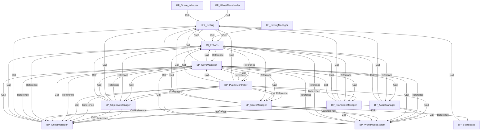

# Global System Diagram

```mermaid
flowchart TD
    BFL_Debug -->|Call| GI_Echoes
    BP_AudioManager -->|Reference| BP_WorldModeSystem
    BP_AudioManager -->|Reference| BP_GhostManager
    BP_AudioManager -->|Call| BFL_Debug
    BP_AudioManager -->|Call| GI_Echoes
    BP_AudioManager -->|Call| BP_WorldModeSystem
    BP_AudioManager -->|Call| BP_GhostManager
    BP_DebugManager -->|Call| GI_Echoes
    BP_GhostManager -->|Reference| BP_SaveManager
    BP_GhostManager -->|Call| BFL_Debug
    BP_GhostManager -->|Call| GI_Echoes
    BP_GhostManager -->|Call| BP_SaveManager
    BP_GhostPlaceholder -->|Call| BFL_Debug
    BP_ObjectiveManager -->|Reference| BP_SaveManager
    BP_ObjectiveManager -->|Reference| BP_GhostManager
    BP_ObjectiveManager -->|Call| BFL_Debug
    BP_ObjectiveManager -->|Call| BP_SaveManager
    BP_ObjectiveManager -->|Call| GI_Echoes
    BP_ObjectiveManager -->|Call| BP_GhostManager
    BP_PuzzleController -->|Reference| BP_GhostManager
    BP_PuzzleController -->|Reference| BP_TransitionManager
    BP_PuzzleController -->|Reference| BP_ObjectiveManager
    BP_PuzzleController -->|Reference| BP_ScareManager
    BP_PuzzleController -->|Reference| BP_SaveManager
    BP_PuzzleController -->|Call| BFL_Debug
    BP_PuzzleController -->|Call| BP_ScareManager
    BP_PuzzleController -->|Call| BP_ObjectiveManager
    BP_PuzzleController -->|Call| BP_SaveManager
    BP_PuzzleController -->|Call| BP_WorldModeSystem
    BP_PuzzleController -->|Call| BP_GhostManager
    BP_PuzzleController -->|Call| GI_Echoes
    BP_SaveManager -->|Reference| BP_GhostManager
    BP_SaveManager -->|Reference| BP_WorldModeSystem
    BP_SaveManager -->|Call| GI_Echoes
    BP_SaveManager -->|Call| BFL_Debug
    BP_SaveManager -->|Call| BP_GhostManager
    BP_SaveManager -->|Call| BP_WorldModeSystem
    BP_SaveManager -->|Call| BP_ObjectiveManager
    BP_SaveManager -->|Call| BP_PuzzleController
    BP_SaveManager -->|Call| BP_AudioManager
    BP_SaveManager -->|Call| BP_ScareManager
    BP_SaveManager -->|Call| BP_TransitionManager
    BP_ScareBase -->|Call| BFL_Debug
    BP_ScareManager -->|Reference| BP_WorldModeSystem
    BP_ScareManager -->|Reference| BP_GhostManager
    BP_ScareManager -->|Call| BFL_Debug
    BP_ScareManager -->|Call| BP_ScareBase
    BP_ScareManager -->|Call| BP_WorldModeSystem
    BP_ScareManager -->|Call| GI_Echoes
    BP_ScareManager -->|Call| BP_GhostManager
    BP_Scare_Whisper -->|Call| BFL_Debug
    BP_TransitionManager -->|Call| BFL_Debug
    BP_TransitionManager -->|Call| GI_Echoes
    BP_TransitionManager -->|Call| BP_WorldModeSystem
    BP_TransitionManager -->|Call| BP_SaveManager
    BP_WorldModeSystem -->|Reference| BP_SaveManager
    BP_WorldModeSystem -->|Call| BFL_Debug
    BP_WorldModeSystem -->|Call| BP_SaveManager
    GI_Echoes -->|Reference| BP_SaveManager
    GI_Echoes -->|Reference| BP_ObjectiveManager
    GI_Echoes -->|Reference| BP_GhostManager
    GI_Echoes -->|Reference| BP_ScareManager
    GI_Echoes -->|Reference| BP_WorldModeSystem
    GI_Echoes -->|Reference| BP_TransitionManager
    GI_Echoes -->|Reference| BP_PuzzleController
    GI_Echoes -->|Reference| BP_AudioManager
    GI_Echoes -->|Call| BFL_Debug
```
