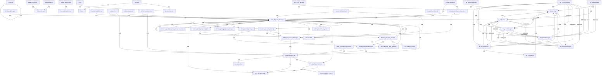

# Global System Diagram

```mermaid
flowchart TD
    BFL_Debug -->|Call| GI_Echoes
    BP_AudioManager -->|Reference| BP_GhostManager
    BP_AudioManager -->|Call| BFL_Debug
    BP_AudioManager -->|Call| GI_Echoes
    BP_AudioManager -->|Call| BP_GhostManager
    BP_DebugManager -->|Call| GI_Echoes
    BP_GhostManager -->|Reference| BP_SaveManager
    BP_GhostManager -->|Call| BP_SaveManager
    BP_GhostManager -->|Call| BFL_Debug
    BP_GhostManager -->|Call| BP_ObjectiveManager
    BP_GhostManager -->|Call| BP_ScareManager
    BP_GhostPlaceholder -->|Call| BFL_Debug
    BP_ObjectiveManager -->|Reference| BP_SaveManager
    BP_ObjectiveManager -->|Call| GI_Echoes
    BP_ObjectiveManager -->|Call| BFL_Debug
    BP_ObjectiveManager -->|Call| BP_SaveManager
    BP_PuzzleController -->|Reference| BP_GhostManager
    BP_PuzzleController -->|Reference| BP_ObjectiveManager
    BP_PuzzleController -->|Reference| BP_ScareManager
    BP_PuzzleController -->|Reference| BP_SaveManager
    BP_PuzzleController -->|Call| BP_ObjectiveManager
    BP_PuzzleController -->|Call| BFL_Debug
    BP_PuzzleController -->|Call| BP_GhostManager
    BP_PuzzleController -->|Call| BP_SaveManager
    BP_PuzzleController -->|Call| BP_ScareManager
    BP_SaveManager -->|Reference| BP_GhostManager
    BP_SaveManager -->|Call| GI_Echoes
    BP_SaveManager -->|Call| BFL_Debug
    BP_ScareBase -->|Call| BFL_Debug
    BP_ScareManager -->|Call| BFL_Debug
    BP_ScareManager -->|Call| BP_ScareBase
    BP_ScareManager -->|Call| GI_Echoes
    BP_Scare_Whisper -->|Call| BFL_Debug
    DatasmithActor -->|Call| DatasmithLayer
    DatasmithSelector -->|Call| DatasmithLayer
    Debug_MeshCutout -->|Call| Impostor_MeshCutout
    DLWE_Interaction -->|Call| UltraDynamicWeather_Functions
    DLWE_Interaction -->|Call| Ultra_Dynamic_Weather
    GI_Echoes -->|Reference| BP_SaveManager
    GI_Echoes -->|Reference| BP_ObjectiveManager
    GI_Echoes -->|Reference| BP_GhostManager
    GI_Echoes -->|Reference| BP_ScareManager
    GI_Echoes -->|Call| BFL_Debug
    GI_Echoes -->|Call| BP_SaveManager
    Pistol -->|Call| GrabComponent
    Projectile -->|Call| Projectile
    Puddle_Fluid_Volume -->|Call| Ultra_Dynamic_Weather
    Radial_Storm -->|Call| Ultra_Dynamic_Sky
    Radial_Storm -->|Call| Ultra_Dynamic_Weather
    Rain_Drip_Spline -->|Call| Ultra_Dynamic_Weather
    Random_Weather_Variation -->|Call| UDS_Climate_Preset
    Random_Weather_Variation -->|Call| UltraDynamicSky_Functions
    Random_Weather_Variation -->|Call| UDW_Material_State_Manager
    UDS_Client_Controller -->|Call| Ultra_Dynamic_Sky
    UDS_Client_Controller -->|Call| Ultra_Dynamic_Weather
    UDS_Cloud_Paint_Container -->|Call| Ultra_Dynamic_Sky
    UDS_PlayerOcclusion -->|Call| UDS_OcclusionState
    UDS_PlayerOcclusion -->|Call| UDS_Occlusion_Volume
    UDW_Temperature_Manager -->|Call| Ultra_Dynamic_Sky
    UltraDynamicSky_Functions -->|Call| Ultra_Dynamic_Sky
    UltraDynamicWeather_Functions -->|Call| Ultra_Dynamic_Weather
    Ultra_Dynamic_Sky -->|Call| UDS_PlayerOcclusion
    Ultra_Dynamic_Sky -->|Call| UDS_OcclusionState
    Ultra_Dynamic_Sky -->|Call| UDS_Modifier
    Ultra_Dynamic_Weather -->|Call| Ultra_Dynamic_Sky
    Ultra_Dynamic_Weather -->|Call| Random_Weather_Variation
    Ultra_Dynamic_Weather -->|Call| UDW_Temperature_Manager
    Ultra_Dynamic_Weather -->|Call| UDW_Material_State_Manager
    Ultra_Dynamic_Weather -->|Call| Weather_Override_Volume
    Ultra_Dynamic_Weather -->|Call| UDS_PlayerOcclusion
    Ultra_Dynamic_Weather -->|Call| UDS_RenderTarget_State
    Ultra_Dynamic_Weather -->|Call| WeatherMask
    Ultra_Dynamic_Weather -->|Call| UltraDynamicSky_Functions
    Ultra_Dynamic_Weather -->|Call| Weather_Mask_Projection_Box
    Ultra_Dynamic_Weather -->|Call| Weather_Mask_Projection_Box_Component
    Ultra_Dynamic_Weather -->|Call| UDS_Weather_Settings
    Ultra_Dynamic_Weather -->|Call| UDW_Lightning_Spawn_Manager
    Ultra_Dynamic_Weather -->|Call| UDS_OcclusionState
    VRPawn -->|Call| GrabComponent
    VRPawn -->|Call| Menu
    WeatherMask -->|Call| Ultra_Dynamic_Weather
    WeatherMask -->|Call| UltraDynamicWeather_Functions
    Weather_Mask_Brush -->|Call| WeatherMask
    Weather_Mask_Brush -->|Call| Ultra_Dynamic_Weather
    Weather_Mask_Projection_Box -->|Call| WeatherMask
    Weather_Mask_Projection_Box -->|Call| Ultra_Dynamic_Weather
    Weather_Mask_Projection_Box_Component -->|Call| Ultra_Dynamic_Weather
    Weather_Override_Volume -->|Call| Ultra_Dynamic_Weather
    Weather_Override_Volume -->|Call| Random_Weather_Variation
    Weather_Override_Volume -->|Call| UDW_Temperature_Manager
    Weather_Override_Volume -->|Call| UDW_Material_State_Manager
    Wind_Physics_Force -->|Call| Ultra_Dynamic_Weather
```
